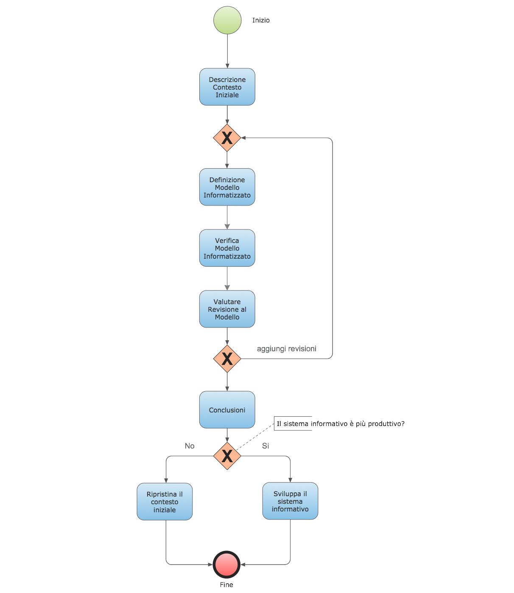

=====================
DOCUMENTO DI PROCESSO
=====================

..
  TODO: aggiungere indice - fatto
        aggiornare link prima di pubblicare   
        
----

Indice
______

`1 Introduzione`_

  `1.1 Caratteristiche del documento`_

`2 Processo decisionale`_

  `2.1 Descrizione del contesto`_

    `2.1.1 Preambolo`_

    `2.1.2 Il caso di studio`_

    `2.1.3 Gli Stakeholder`_

  `2.2 Modello informatizzato`_

    `2.2.1 Premessa`_

    `2.2.2 L’Attività di Raccolta dei requisiti`_

    `2.2.3 Il prototipo`_

  `2.3 Verifica del modello`_

    `2.3.1 Gli aspetti funzionali`_

    `2.3.2 Gli aspetti della produzione`_

    `2.3.3 L'analisi costi benefici`_

    `2.3.4 L'analisi di fattibilità`_

  `2.4 Revisioni del modello`_

  `2.5 Conclusioni`_

`3 Glossario`_

1 Introduzione
==============

Questo documento nasce con lo scopo di definire, analizzare e documentare
il processo decisionale che stabilisce se e come introdurre in azienda
un nuovo sistema informativo.

1.1 Caratteristiche del documento
---------------------------------

Questo documento avrà contenuti e struttura dinamici, sottoposti quindi
a continue revisioni.
Per controllare le versioni del documento cosi come avviene nelle fasi di sviluppo
dei software più moderni stabiliamo di pubblicare questo documento in un apposito repository
nella piattaforma OpenSource GitHub. Ciò consentirà integrazioni e correzioni
da parte di tutti i soggetti interessati.

Il repository è disponibile all’indirizzo:

https://github.com/SalvoS81/Documento_di_processo

La versione aggiornata del presente documento è disponibile all'indirizzo:

https://github.com/SalvoS81/Documento_di_processo/blob/master/docs/processo.rst

Nel documento verranno utilizzate le seguenti etichette per meglio definire la fase di completezza dell'argomento a cui fanno riferimento.

  *(bozza)*: l'etichetta precede un paragrafo in fase di abbozzo e soggetto a probabili revisioni e integrazioni.

  *(in attesa)*: l'argomento trattato è in attesa di azioni preliminari.

  *-(?)-*: la nozione non è del tutto giustificata o non sono presenti le fonti.

  *(continua...)*: l'argomento non è stato trattato nella sua interezza, pur avendo completato l'analisi.

2 Processo decisionale
======================

Per definire il processo decisionale cominceremo con lo scomporre lo
stesso in sotto-attività.

Nella Figura 1 descriviamo il processo con la notazione BPNM, quindi come in altri
processi produttivi partiremo da un punto iniziale per giungere ad un punto finale,
di seguito ciò che faremo:

-  Descriveremo il contesto iniziale, individueremo un processo di lavoro tradizionale e descriveremo in sintesi "**CHI** fa **COSA** e **COME**".
-  Definiremo un modello informatizzato più efficiente e produttivo
   rispetto al "**CHI** fa **COSA** e **COME**" da contesto iniziale.
-  Verificheremo se il modello informatizzato è effettivamente più
   efficiente e produttivo.
-  Valuteremo eventuali revisioni da apportare al modello
   informatizzato.
-  Concluderemo se mantenere il contesto iniziale o sviluppare il
   modello informatizzato.

   Figura 1: Processo decisionale in notazione BPNM.

2.1 Descrizione del contesto
----------------------------

2.1.1 Preambolo
~~~~~~~~~~~~~~~
L’Azienda promotrice del processo è una storica società di trasporto
pubblico locale di diritto privato interamente a controllo pubblico.

La divisione aziendale oggetto del sistema informativo è quella
incaricata della produzione del servizio di linea; denominata secondo la
contrattazione collettiva di settore “Area operativa Esercizio: Sezione
Automobilistico, filoviario e tranviario”.

Obiettivo principale della suddetta divisione è quello di mettere su
strada bus e conducenti per fornire il servizio di linea urbano.

2.1.2 Il caso di studio
~~~~~~~~~~~~~~~~~~~~~~~~
Per gestire il servizio di linea urbano gli impiegati del reparto fanno un uso quasi
esclusivo di prestampati cartacei. La riassegnazione del personale, le registrazioni di
inizio lavoro, fine lavoro, cambi e assenze vengono gestite con mezzi
tradizionali, per lo più comunicazioni verbali e cartacee. Ciò comporta numerose
interazioni per gli addetti alla gestione del personale e dei mezzi, con diverse
conseguenze sul piano dell’efficienza e della produttività.

Può capitare ad esempio che, pur essendo dotato di un moderno sistema di
radiolocalizzazione dei mezzi, lo stesso settore non riesca a dare una
rappresentazione coerente dei mezzi su strada, ciò capita quando la
catena di comunicazione tra le diverse parti si interrompe.

Inoltre per i manager l’accesso ai dati aggregati sull’efficienza e
sulla produzione non è mai in tempo reale né tanto meno di immediata
visualizzazione.

2.1.3 Gli Stakeholder
~~~~~~~~~~~~~~~~~~~~~
*(bozza)*

Dal contesto cosi descritto e per le successive attività che andremo a svolgere possiamo dedurre
i soggetti interessati dal processo.

* Gli utenti del sistema:

  -   I graduati: Devono poter gestire il servizio ed il personale attraverso il sistema informativo.
  -   I coordinatori e i manager: Devono poter accedere ai report sulla posizione e in generale ai dati aggregati sul servizio.
  -   I conducenti: Negli eventuali sviluppi successivi potrebbero poter visionare la loro turnazione e il loro monte ore.
  -   L'ufficio paga: Devono poter visionare i turni effettivi svolti dai conducenti.
* Gli sviluppatori:

  -   Devono poter progettare, sviluppare, collaudare il sistema, potrebbero essere sia soggetti interni che esterni all'azienda.
* I manutentori del sistema:

  -   Devono poter mantenere e salvaguardare il sistema, devono poter fornire assistenza agli utenti.
* Altri soggetti:
  -   I manager incaricati delle decisione inerenti lo sviluppo e l'adozione del sistema.
  -   L'eventuale società terza incaricata dello sviluppo del software finale.

2.2 Modello informatizzato
--------------------------

2.2.1 Premessa
~~~~~~~~~~~~~~

La produzione di software in quando attività umana altamente complessa,
è soggetta ad ingegnerizzazione.

Nell'ingegneria del software l'insieme delle attività utilizzate per la
produzione di un software vengono raggruppati sotto la definizione di
ciclo di vita del software.

Un esempio tipico di ciclo di vita del software potrebbe essere quello
riportato in Figura 2.

   Figura 2: Esempio di ciclo di vita del software.

Esistono diversi modelli di ciclo di vita del software, per lo più non
standardizzati. Infatti in ciascuno di essi le varie attività assumono
un peso più o meno differente a seconda anche dei tempi e dei costi di produzione.
A ogni modo, in tutti i modelli, l’attività che è imprescindibile per tutte
le altre è quella della raccolta dei requisiti.

Quindi per definire il nostro modello informatizzato cominceremo con la raccolta
dei requisiti per poi passare alla creazione di un prototipo da sottoporre a verifica.

*Per la produzione del prototipo occorrerà scegliere un ciclo di produzione del software
e personalizzarlo secondo le esigenze del processo sin qui definito.*

2.2.2 L’Attività di Raccolta dei requisiti
~~~~~~~~~~~~~~~~~~~~~~~~~~~~~~~~~~~~~~~~~~

Di norma la raccolta e l'analisi dei requisiti è un processo svolto
dagli analisti della azienda terza che riceve l'incarico di produrre il
software.

Nel nostro caso specifico è un’attività che faremo inizialmente in
house, perché da questa e dalle successive analisi dipenderà l'eventualità di
esternalizzare la produzione del software.

Gli scopi dell'analisi dei requisiti si possono riassumere sinteticamente in quanto segue:

-  Serve a descrivere astrattamente a **CHI** il software dovrebbe permettere di fare **COSA**.
-  Serve ad individuare il domino e i vincoli che il software dovrebbe rispettare.
-  Deve permettere di produrre il documento con la "specifica dei requisiti", che è l’insieme delle richieste e dei vincoli contrattuali tra il committente e il produttore ed è anche il punto di partenza per i progettisti e gli sviluppatori.

I metodi utilizzati per la raccolta possono essere:

- Interviste, questionari
- Studio di documenti che esprimono i requisiti in forma testuale
- Osservazione passiva o attiva del processo da modellare
- Studio di sistemi software esistenti

Poiché una parte del lavoro di raccolta è stato in già effettuato procederemo alla stesura della prima versione
del documento dei requisiti, per poi eventualmente modificarlo con successive verifiche e approfondimenti.

Il documento si trova a questo indirizzo `Documento di Analisi e Specifica <analisi.rst>`_.

2.2.3 Il prototipo
~~~~~~~~~~~~~~~~~~
*(in attesa)*

2.3 Verifica del modello
------------------------
*(in attesa)*

2.3.1 Gli aspetti funzionali
~~~~~~~~~~~~~~~~~~~~~~~~~~~~~
*(in attesa)*

2.3.2 Gli aspetti della produzione
~~~~~~~~~~~~~~~~~~~~~~~~~~~~~~~~~~
*(bozza)*

Una delle prime considerazioni che emerge dall'analisi del modello è quella relativa
alle dinamiche di produzione dello stesso, nello specifico delle differenze che esistono tra la
produzione in house e la produzione attraverso aziende terze.

Ciascun metodo presenta dei vantaggi e degli svantaggi, proveremo ad elencarli di seguito.

Produzione in **interna**:

**Contro:**

- richiesta di personale qualificato, non previsto nell'attuale dominio aziendale.
- *tempi e costi di produzione non facili da quantificare a priori.* *-(?)-*
- *mancanza di garanzia da terzi.*  *-(?)-*

**Pro:**

- alta personalizzazione del sistema.
- ciclo di vita del software personalizzabile, ritmo di produzione gestibile.
- *costi per aggiornamenti uguali ai costi di manutenzione.*  *-(?)-*
- *costi potenzialmente inferiori.*  *-(?)-*

Produzione in **esterna**:

**Contro:**

- personalizzazioni successive a pagamento.
- i tempi sono funzione dell'azienda terza.
- assistenza e manutenzione a pagamento.
- *legame con azienda terza, da definire.*  *-(?)-*
- *costi potenzialmente crescenti.*  *-(?)-*
- *tempi di intervento superiori.*  *-(?)-*

**Pro:**

- tempi e costi di consegna teoricamente prestabiliti.
- assistenza esterna.
- garanzia da terzi.

...

2.3.3 L'analisi costi benefici
~~~~~~~~~~~~~~~~~~~~~~~~~~~~~~~~~~~~~
*(in attesa)*

2.3.4 L'analisi di fattibilità
~~~~~~~~~~~~~~~~~~~~~~~~~~~~~~
*(in attesa)*

2.4 Revisioni del modello
-------------------------

*(in attesa)*

2.5 Conclusioni
---------------

*(in attesa)*

3 Glossario
===========

sistema informativo:

BPMN:
